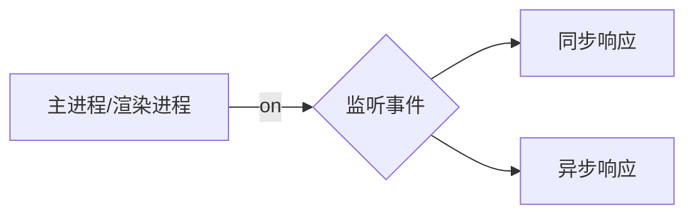

# 


**应用场景：**

- electron@5.x 之前，渲染进程直接跟主进程通讯
- `electron@5.x` 之后，默认关闭上下文隔离：`{ contextIsolation:true }`
- `electron@5.x` 之后，默认开启上下文隔离：`{ contextIsolation:false }`

# 一、ipc 套件 

## send/on （旧）

渲染进程向主进程发起请求，主进程进行监听处理，并返回结果。

渲染进程和主进程的通讯机制是相同的，只是对应api不同


### **通讯模型:**



- 主进程

```js
// 主进程中进行监听
const ipcMain = require('electron').ipcMain;
ipcMain.on('from-renderer', function(event, msg) {
  // 监听 'asynchronous-message' 事件
  console.log(msg);  
    
  // 【同步】响应
  event.returnValue = 'pong';
    
  // 【异步】响应
  event.sender.send('asynchronous-reply', 'pong');
});
```


- 渲染进程

```js
// 渲染进程(renderer.js)
const ipcRenderer = require('electron').ipcRenderer;

/* 向主进程发送 'ping' */
// 【同步】
ipcRenderer.sendSync('from-renderer', 'ping')

// 【异步】 触发主进程 'from-renderer'事件
ipcRenderer.send('from-renderer', 'ping');

// 【异步】响应
ipcRenderer.on('asynchronous-reply', (event, msg)=>{
    // 【异步】获取主进程传送过来的数据
    console.log(msg); 
})
```


## handle/invoke（新）

**相关接口：**

- ipcMain.handle
- ipcMain.handleOnce
- ipcMain.removeHandler

```js
// 主进程
ipcMain.handle('my-invokable-ipc', async (event, ...args) => {
  const result = await somePromise(...args)
  return result
})

// 渲染进程
async () => {
  const result = await ipcRenderer.invoke('my-invokable-ipc', arg1, arg2)
  // ...
}
```


# 二、MessageChannelMain

官方介绍 MessageChannelMain 等价与 DOM MessageChannel 对象，

```js
// 主进程
const { MessageChannelMain } = require('electron')
const { port1, port2 } = new MessageChannelMain()
w.webContents.postMessage('port', null, [port2])
port1.postMessage({ some: 'message' })

// 渲染器进程
const { ipcRenderer } = require('electron')
ipcRenderer.on('port', (e) => {
  // e.ports is a list of ports sent along with this message
  e.ports[0].on('message', (messageEvent) => {
    console.log(messageEvent.data)
  })
})
```


# 三、remote 模块

# 四、上下文隔离

